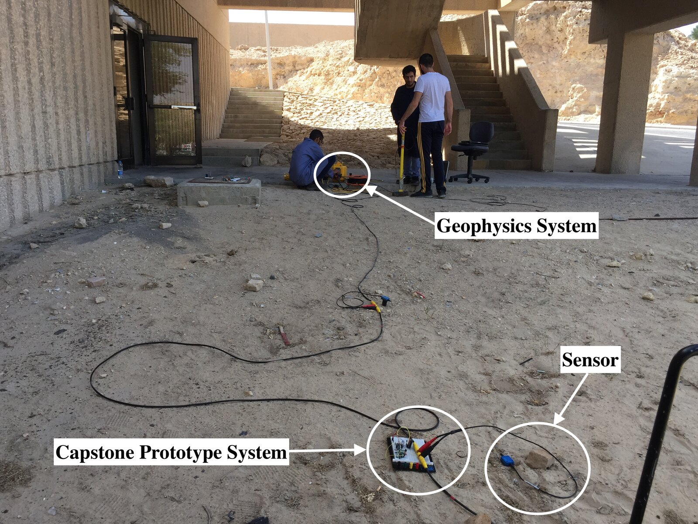
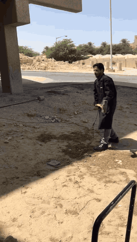
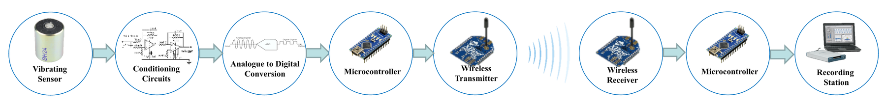
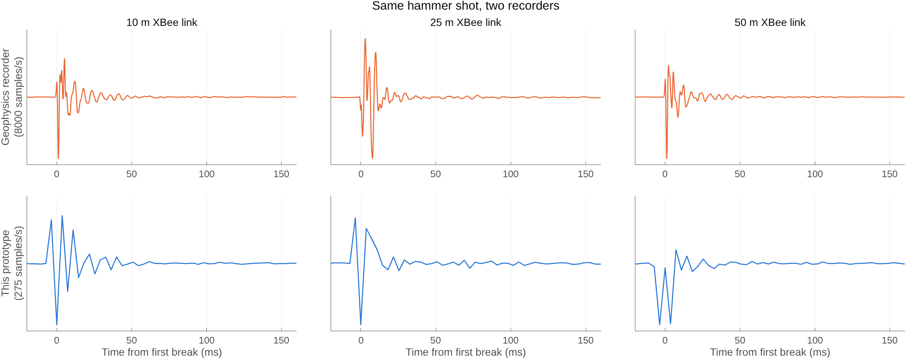

# Wireless Seismic Data Acquisition

A cable-free seismic recorder made from a geophone, a 24-bit ADC, two Arduino Nanos, and a pair of XBee radios. We built it as our senior design project in Electrical Engineering at King Fahd University of Petroleum & Minerals (KFUPM) in spring 2018. It won the Best Project Award at the KFUPM Electrical Engineering Senior Design Expo (2017/2018).

In a land seismic survey, the cables between the geophones and the recording truck make up about half the cost and three quarters of the equipment weight (Savazzi et al., 2013). We wanted to see how far off-the-shelf parts could go toward replacing them, on a budget of 500 SAR. The prototype came in at about 400 SAR (US$105).

  
  

## How it works

- **Sensor:** SM-24 coil geophone. We also tested a piezo cantilever (MiniSense 100) and an MPU-6050 accelerometer, and the geophone gave the smoothest impulse response.
- **Conditioning:** NE5532 differential preamp (gain 10), Sallen-Key low-pass at 968 Hz, passive high-pass at 3.4 Hz, switchable gain of 11, 69, 101, or 221, and a diode clipper to protect the ADC.
- **ADC:** AD7714 24-bit delta-sigma with an AD780 2.5 V reference, differential input, one conversion every 2 ms, read over SPI.
- **Link:** XBee S2C (Zigbee) in transparent mode at 19200 baud. Each sample goes over the air as a line of ASCII digits (millivolts).
- **Receiver:** A second Nano writes every sample to an SD card.

## Results

On 19 April 2018 we took the prototype to a field test run by the KFUPM Geophysics Department. One geophone was wired to both our prototype and the department's cabled seismic recorder, and a sledgehammer struck the ground next to it. We repeated the shot with the XBee link at 0, 5, 10, 25, and 50 m.

The prototype records the same first arrival and ring-down as the department's recorder, at a much lower sample rate. These traces come from the transmitter's own log, recorded while it sent every sample to the XBee. The 19200-baud serial line to the radio held it to about 275 samples/s. The two shots logged over USB alone ran at 505 samples/s, close to the ADC's 2 ms conversion time.

In the lab we fed sine waves from 1 to 90 Hz into the ADC and recorded them at the receiver. For every input, the FFT peak of the received signal was within 0.35 Hz of the input frequency.

The [final report](docs/final-report.pdf) has the full design and test results. There is also a [poster](docs/poster.pdf) and a [75-second demo video](media/videos/demo.mp4).

## Repository

| Folder | Contents |
|---|---|
| [`firmware/`](firmware) | Transmitter and receiver sketches, bring-up tests, and the paths we dropped (nRF24L01 radio, AD574 SAR ADC, MPU-6050) |
| [`hardware/`](hardware) | DipTrace schematics and PCB layout, component values, Analog Discovery 2 captures of every conditioning stage |
| [`analysis/`](analysis) | MATLAB: filter response, sensor models, frequency-sweep FFT, and the figure above |
| [`data/`](data) | Frequency sweep, nine hammer shots with the Geophysics recorder's SEG-2 files, sensor impulse responses, AD574 test data |
| [`docs/`](docs) | Proposal, final report, final presentation, poster |
| [`media/`](media) | Photos and videos |

The sketches target an Arduino Nano and use only the libraries that ship with the Arduino IDE (`SPI`, `SD`, `SoftwareSerial`). The nRF24L01 sketches also need the [RF24](https://github.com/nRF24/RF24) library.

## Team

Abdullah Al-Nafisah, Faisal Al-Masri, Feesal Swaid, Mohanad Al-Mousa, and Mojtaba Al-Shams, advised by Dr. Alaa El-Din Hussein. Thanks to Dr. Hussain Alzaher, and to Ayman Al-Lehyani and Abdul Latif Ashadi of the Geophysics Department, who ran the field test with us.

## References

- S. Savazzi et al., "Ultra-wide band sensor networks in oil and gas explorations," *IEEE Communications Magazine*, 51(4), 2013. [doi:10.1109/MCOM.2013.6495774](https://doi.org/10.1109/MCOM.2013.6495774)
- O. Kafadar and I. Sertcelik, "A computer-aided data acquisition system for multichannel seismic monitoring and recording," *IEEE Sensors Journal*, 16(18), 2016. [doi:10.1109/JSEN.2016.2592960](https://doi.org/10.1109/JSEN.2016.2592960)
- J. Havskov and G. Alguacil, *Instrumentation in Earthquake Seismology*, 2nd ed., Springer, 2016. [doi:10.1007/978-3-319-21314-9](https://doi.org/10.1007/978-3-319-21314-9)
- M. Makama, K. Kuladinithi, and A. Timm-Giel, "Wireless geophone networks for land seismic data acquisition: a survey, tutorial and performance evaluation," *Sensors*, 21(15), 2021. [doi:10.3390/s21155171](https://doi.org/10.3390/s21155171)
- Datasheets: [SM-24](https://cdn.sparkfun.com/datasheets/Sensors/Accelerometers/SM-24%20Brochure.pdf), [AD7714](https://www.analog.com/en/products/ad7714.html), [AD780](https://www.analog.com/en/products/ad780.html), [NE5532](https://www.ti.com/product/NE5532), [XBee S2C](https://www.digi.com/products/embedded-systems/digi-xbee/rf-modules/2-4-ghz-rf-modules/xbee-zigbee). Digi no longer recommends the S2C for new designs and points to the [XBee 3](https://www.digi.com/products/embedded-systems/digi-xbee/rf-modules/2-4-ghz-rf-modules/xbee3-zigbee-3) instead.
